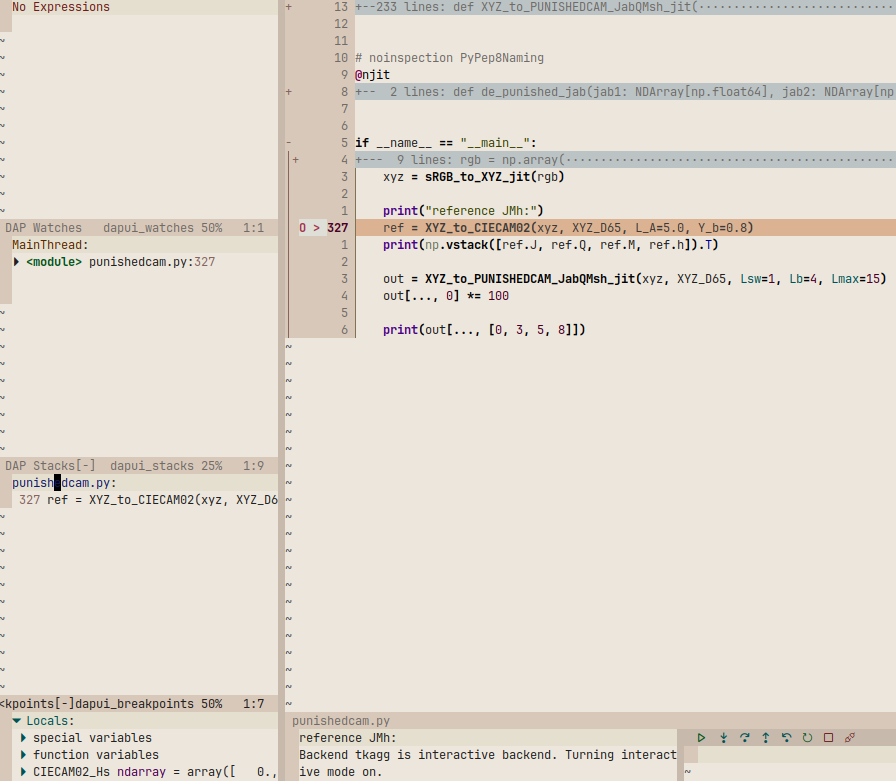

# salmon.nvim

*the supreme way to experience light and color*

<div align="right">
  
</div>

## What is this?

This repo is the neovim version of the world-renowned JetBrains [Restrained Salmon Theme](https://plugins.jetbrains.com/plugin/16259-restrained-salmon-theme/edit/analytics) ([github](https://github.com/qdbp/SalmonTheme))

It uses ground-breaking Color Science™ from my [Palette Gen](https://github.com/qdbp/palette_gen) library.

You should use this theme if
1. you have finally grasped the inferiority of dark mode
2. you want a Financial Times ~ Manhattan Project vibe in your editor
3. love voluptuously rich yet amazingly readable colors, used with tasteful restraint
4. (**COMING SOON**) want a rotation of palettes that adjust to your ambient surroundings and time of day

I also have pretty decent plugin coverage.

## Examples




## Installation

### lazy.nvim

```lua
{
  "qdbp/salmon.nvim",
  opts = {},
  lazy = false,
  priority = 1337,
}
```

### Other Installers

Not my problem -- just use lazy.nvim.

## Contributing

Contributions must satisfy the three cardinal rules:

1. have impeccable taste
2. not make my job harder
3. maintain this theme as an elite, rarefied experience.

Who determines good taste? I do.

Also: no emojis, anywhere, ever, for whatever reason (see rule 1).

## Design Principles

The theme tries to follow a consistent design language, where it does not conflict with beauty:

#### Bold Is Control Flow

The only things that are bold are keywords, function calls and any other
language construct -- modulo my ability to select it for highlighting -- that
alters control flow. Nothing else is bold: not declarations, not global
variables, etc.

This creates the effect such that glancing at a block of code, its structure
and its calls visually pop out to give a high-level impression at a glance, without
being crowded out by identifier specifics.

#### Italics are Mutability

Wherever sensible, mutable variables or mutation in general are denoted by
italics. This is interpreted sensibly, in that I don't, for instance, make every
variable in Python or every non-final variable in Java italic.

#### Color Is Semantics

The most important fact about colors in this theme is that they have global,
cross-language semantics. Each color is assigned a specific meaning such as,
namespace, global variable, interface, number, etc. This color is then used as
exclusively as possible in this role across languages.

These interpretations, of course, have to be stretched depending on the
particular language; however, I always aim to keep the meanings as true as
possible.

Generally, darker colors are used for type variables and literals.
Colors of medium brightness are used for various mundane identifiers, while the
brightest colors are reserved for global concepts such as labels, constants, and
builtins. Within each of these categories, colors are assigned to try make as
many languages look as pleasing as possible given the semantic consistency
constraint.

The perceptual uniformity of the primary colors ensures that even within this
framework, for any given language the balance of tones looks rather nice, if not
the best it could if colors had free per-language semantics.
